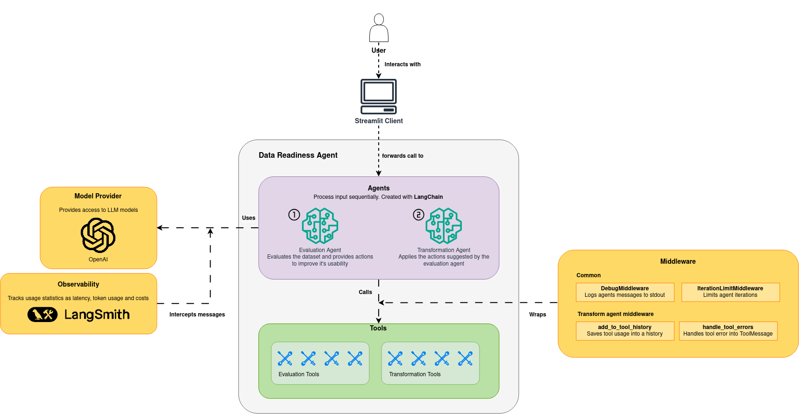

# data-readiness-agent

🇧🇷 [Leia em Português](README.pt-BR.md)

This system analyzes and transforms a structured dataset to make it more suitable for a classic machine learning modeling task (regression or classification). To do this, a first agent evaluates the dataset and generates points for improvement, while a second agent applies transformations based on the first agent's evaluation. The agents area applied sequentially, with the first generating the entire analysis and the second consuming its output to decide how to transform the dataset. Both agents have access to separate sets of tools that retrieve information or act directly on the dataset.

The project was developed using `langchain` as a framework for agent management and `streamlit` to create the interface and hosting. Internally, the OpenAI `gpt-5-nano` model is used in both agents. This model is the cheapest OpenAI model currently available (07/2026). Therefore, the user needs to provide their own access key to the OpenAI API. The cost of processing a dataset depends on its size and the number of problems found by the system. In tests conducted with a Kaggle database containing 5500+ rows, 8 columns, and a small number of issues handled, the costs were approximately 2 to 4 cents per process.

## Experiments

See it at [this notebook](./notebooks/results-EN.ipynb)

## Learnings

1. **Deterministic functions probably don't need to be tools.** Unless it's expensive, it might make sense to compute it once at the beginning before invoking the agent and reporting its result in an initial State.
2. **The agent might want to call the same tool repeatedly with the same input parameters.**
3. **It's useful to have variations of the same tool that have inputs of different sizes.** For example, the tool `data_readyness_agent.agent.py:check_duplicate_rows` receives a subset of columns and calculates something. To calculate for all columns at once, I created the variant `data_readyness_agent.agent.py:check_duplicate_rows_all_cols` so that the agent doesn't need to report all the columns separately, reducing the number of tokens generated.
4. **Do not assume that the agent will provide valid input to a tool.** For example, the tool `data_readyness_agent.agent.py:detect_outliers` and several others check if the column provided by the agent actually exists in the database. In particular, LLM has repeatedly tried to provide an 'id' column even though it does not exist. Basically, treat the agent as any other user of a system who can enter invalid information.
5. **The agent cannot directly access the initial State.** Even when an initial State is provided, the LLM knows nothing beyond the messages and contexts passed at the time of its invocation. Therefore, it is necessary to have tools that allow the agent to query the State.
6. **Limit the number of agent iterations.** The agent was entering a loop of tool calls even if they had already been called before. Adding the maximum investigation cycles property is a way to instruct the agent to generate the response and save tokens.
7. **A system that only validates the database and finds problems is not agentic or very useful.** Thus, treating validation as one agent and corrections as another is more complex and useful.
8. **It is possible to prevent parallel agent transformations.** The data transformation agent was trying to apply multiple changes to the original data in the same cycle, and this caused errors. It was possible to prevent this with `model_kwargs={"parallel_tool_calls": False}` in the model instantiation. This causes the agent to call only one tool per cycle.
9. **It is possible to definitively limit the execution of an agent**. There is an argument `config={"recursion_limit": <qt_maxima_supersteps>}` that can be provided in the agent `invoke` to limit the number of supersteps to be executed. If the agent exceeds this limit, it raises an error and does not generate the response. In a system where people will be charged for usage (using the OpenAI key), preventing the agent from looping is a way to avoid unwanted charges.
10. **Structuring the prompt and checking for suspicious words can prevent prompt injection.** Following the [OWASP Cheat Sheet for Prompt Injection Prevention](https://cheatsheetseries.owasp.org/cheatsheets/LLM_Prompt_Injection_Prevention_Cheat_Sheet.html), I [structured the *system-prompts*](https://cheatsheetseries.owasp.org/cheatsheets/LLM_Prompt_Injection_Prevention_Cheat_Sheet.html#structured-prompts-with-clear-separation) from both models and added a [class that tries to detect common phrases and words from being used in *prompt-injections*](https://cheatsheetseries.owasp.org/cheatsheets/LLM_Prompt_Injection_Prevention_Cheat_Sheet.html#input-validation-and-sanitization). This, combined with the classes that indicate the structure of the response generated by the model (`src_data_readyness_agent/common/data_structs.py:EvalAgentResponse`), ensured that, in quick prompt-injection tests, the model continued to function normally.
11. **System evaluation should be considered from the conception stage.** Designing the system thinking only about its capabilities (such as which tools will exist) and user response can lead to a system where it is difficult to automatically assess its quality through benchmarking. Structuring the expected agent response to contain sufficient information that can be checked by a deterministic evaluator is good for the overall system evaluation. Depending on the context, it may be necessary to use LLM-as-a-Judge, which is less deterministic and more expensive.
12. **Just because a model is cheaper on paper doesn't mean it will be the cheapest option for the solution.** As shown in the experiment notebook, the cheapest model tested (*gpt-4.1-nano*) was not the one with the best cost-benefit ratio in the baseline evaluation step. In fact, the model with the best observed cost-benefit ratio was *gpt-5-mini*, the second most expensive on the tested list. This shows that creating a benchmark for testing baseline models is important to decide, based on the task, which model is the most efficient.

## Running Locally

From the project's root folder, create a virtual environment with: `make install`. Then, run the system with `make run`. `uv` must be installed.

Alternatively, you can install the project manually with `pip` by creating a virtual environment, installing the dependencies listed in `pyproject.toml`, and running the system with `python -m streamlit run main.py`.
